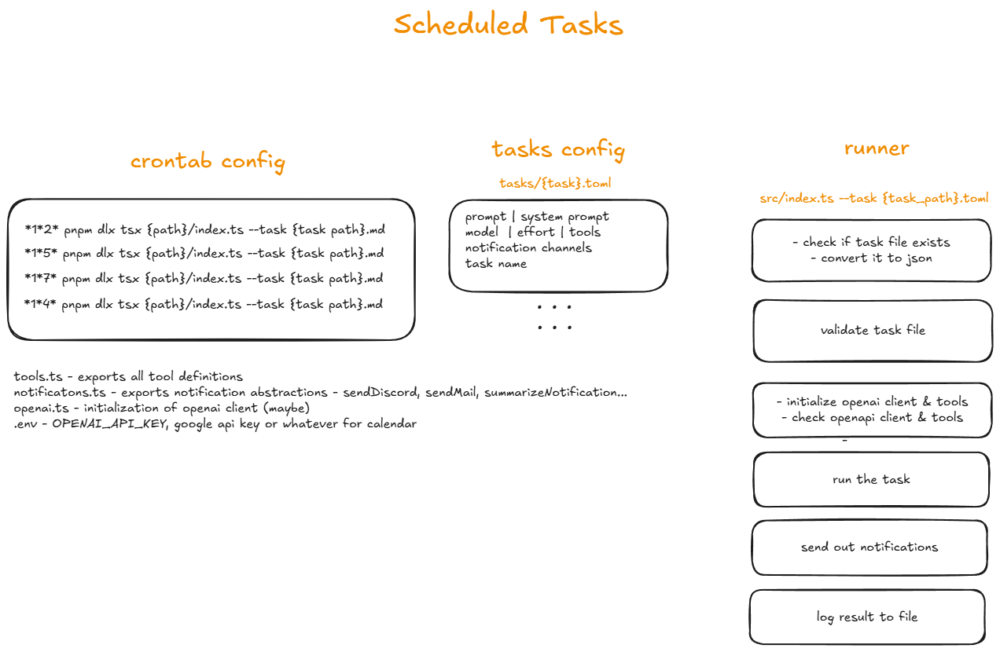

# Scheduled Tasks

### This app was fucking written with no AI AND I REALLY REGRET THE HOURS WASTED ON MAKING MY OWN SHITTY ASS WANNABE ZOD JSON VALIDATOR LMAO. Among other things...

AI-based cron jobs that run periodically and invoke an AI prompt, providing tools to it (web search and saving memories) and sending the result to Discord. Should work exactly like Perplexity Scheduled Tasks.

Memories will be saved as .txt files and should be live, AI maintained, brief documents where the AI stores information for next instances to have. It should include notes for next run, the output of previous runs (e.g. the specific recommendation it gave to me in regards to something, so that it does not repeat it in the future), or user preferences (perhaps at the top).

Web search is yet to be figured out. Service (MCP server)? Local function with some web search SDK? Or a locally running MCP server?

---

1. in crontab, we define the actual cron jobs
2. cron will call a specific script file in src/tasks, like {absolute path}/tsc {path}/src/tasks/task_1.ts
3. the task defines prompt, system prompt, available functions the AI can call, and then call a shared function that will do the rest.
4. When the AI finishes, a notification is sent to discord with the full content of the output (Q: how do we handle message length limits?)

## Tools

- Google Calendar
- Memories (file edit/read/(create?))
- Web search
